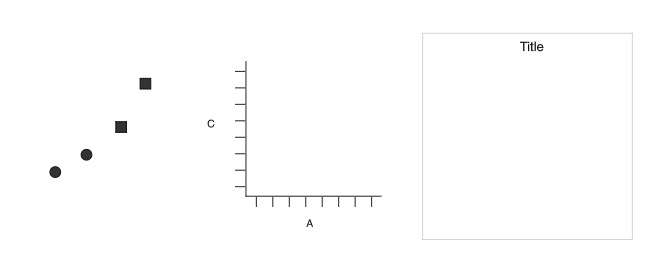

# Using Markdown

This is an *R Markdown Notebook*. When you execute code within the notebook, the results appear beneath the code.
Alongside this document there is also a cheatsheet for using *R Markdown*. 

Try executing this chunk by clicking the Run button within the chunk or by placing your cursor inside it and pressing Cmd+Shift+Enter.

```{r}

plot(cars)

```


Add a new chunk by clicking the *Insert Chunk* button on the toolbar or by pressing *Cmd+Option+I*.


When you save the notebook, an HTML file containing the code and output will be saved alongside it (click the *Preview* button or press *Cmd+Shift+K* to preview the HTML file).


# Datasets in R

The first thing we will do is just play with a data set summarizing the data in different ways and generating plots to explore the results.  Throughout this lesson i am going to present you with challenges. These challenges should not be too difficult for you at this point and so if you are having trouble completeing these tasks quickly in class it is a sign that you need to spend way more quality time with R.

One valuable tool that you can take advantage to further explore R's functionality and for practicing playing with data is to use R's huge library of stock data sets.  There are data sets representing a vast array of different kinds of data.  To see a list of the available datasets you can run the help function: `library(help="datasets")`

```{r}
#install.packages("datasets")
library(help="datasets")
library(datasets)

```


Just to illustrate we will generate the famous "Keeling Curve describing
CO2 concentrations over time".

These data are available using the data name co2.  This particular data set is stored as a time series, which is a special data format that you can (and probably should) investigate on your own time.  But, even without knowing the details of the data format we can generate the plot below using base R

```{r}
plot(co2, ylab = expression("Atmospheric concentration of CO"[2]),
     las = 1,main = "Mauna Loa co2 data set")
```


# Plotting in ggplot

ggplot has become a standard tool in producing publication quality plots, and is often integrated into other packages' plotting functions. It is best to understand the basics of both base R plotting and ggplot.


## What is ggplot?
What is a graphic? How can we succinctly describe a graphic? And how can we create the graphic that we have described? ggplot2 stemmed out of an attempt to provide the answers to these questions. Well more precisely ggplot2 is the consequence of development of a “grammar of graphics”…hence the gg part of ggplot is for “grammar of graphics”. “The grammar of graphics”" was published as a book in 2005 by Wilkinson, Anand, and Grossman. They proposed a grammar that can be used to describe and construct a wide range of statistical graphics. Why “grammar”, well the definition of a grammar is “the fundamental principles or rules of an art or science”. This grammar was developed into an parameterization by Hadley Wickham (author of the package ggplot2) based around the idea of building up a graphic from multiple layers of data. Having access to a grammar of graphics provides us with a tool that we can use to concisely describe and build the components of a graphic allowing us to move beyond named graphics (e.g., the “scatterplot”) which will provide insight into the deep structure that underlies statistical graphics.

The way ggplot works is that it creates a graphic based on layers specified via the grammar of the R programming implementation of the the Grammar of graphics. It use the basic elements of any figure to start out and build a graphic piece by piece. For example, the below figure illustrates all of the basic components of what we would call a scatter plot.


<div style="width:1200px; height=800px">
#
</div>

From left to write, we have 1) geometric objects, 2) scales and coordinate system,and 3) plot annotations.  If we layer these on top of one another we get

<div style="width:1200px; height=800px">
#
</div>


So there are some basic components of a layered grammar that we can use to build a plot. 

1) data and aesthetic mappings,
2) geometric objects,
3) scales
4) facet specification.
5) transformations
6)coordinate system.

Together, the data, mappings, statistical transformation, and geometric object form a layer. A  plot  may  have  multiple  layers,  for  example,  when  we  overlay  a  scatterplot  with  a smoothed line.

```{r}
#install.packages("ggplot2")
library(ggplot2)

p=ggplot(diamonds,aes(x=carat,y=price))
p1=p+geom_point(aes(shape=color))+geom_smooth(aes(x=carat,y=price))
p1
```

##Add Labels to a plot

In addition to gettting the aesthetics of the data presentation in a form we are happy with, we often want to ajust the appearance and content of the labels.  For example change the x and y axis titles.  Or you may want to change the font size or color.  These tasks can be accomplished by using the `labs` and `theme` operators.  

For example, to add labels to the plot above we can add the following code:
```{r}
p2=p1+labs(title="Scatter Plot",x="Carat",y="Price")
print(p2)
```

There are many commands that fall under the `Theme` heading.  When you are advanced you can define many of these things inside your own theme function.  But for now we will illustrate how each of the elements can be manipulated independently.  We do this by calling the function `theme()` and then specifying the desired appearance of each label and title using `axis.text.?` to change the size of the text, where the question mark specifies which axis you wish to change.  And `axis.title.?` to change the label.  `plot.title` is used to change the name at the top of the plot. `element_text()` is the actual function used to change the text size and appearance.

```{r}
p3=p2+theme(plot.title=element_text(size=40,face="italic"),
            axis.text.y=element_text(size=12),axis.text.x=element_text(size=12),
            axis.title.y=element_text(size=20),axis.title.x=element_text(size=20))
print(p3)
```

Finally, you may want to generate your plot so that the data is presented in multiple panels.  As with most things in R, there are multiple ways to do that.  THe most convenient is to use `facets`.  For example, the above plot is pretty busy and so we can not really distinguish what is happening within each cut type.  So we can seperate these so that each cut is plotted in its own window by using the command `facet_wrap(formula)`.

```{r}
p3+facet_wrap(~cut)+labs(shape="Hue")
```


# Data Manipulation 

For the first exercise in data manipulation we will use the data set "ChickWeight". The ChickWeight data frame has 578 rows and 4 columns from an experiment on the effect of diet on early growth of chicks. However you may notice when you examine the structure of these data `str(ChickWeight)` that the data is stored with many different structure classes to make it useable for many different kinds of applications.  We can easily change it to the format that we need (data.frame most commonly) by just calling it in that format

```{r}
x<-data.frame(ChickWeight)
str(x)
```


Before we start playing with these data you will need to install the package `plyr`.
```{r}
#install.packages("plyr")
library(plyr)
```

In the following sections I am just going to go through things that you might someday want to do with a data set.  First we will try sorting the data.  There are many ways to sort data in R, but I will focus on 2 appraoches that I commonly use.  The first is to use base R functions (clunky and slow) and second to use a more elegant approach using the functionality contained in the `plyr` package. If we examine the ChickWeight data set (e.g. using `head(x)` we will see it is already sorted in ascending order according to Time and Chick.  Lets reverse that order and arrange so that the data set is in descending order by Time.

First we will use the base R funtionality.

```{r}
x[ order(-x$Time), ]
head(x[ order(-x$Time), ],5) # note that I use the - sign to indicate I want this to be descending
##OR
head(x[ order(x$Time,decreasing = TRUE), ],5)

```

We can do this same thing a bit more elgantly using the `arrange` function in the package `plyr`

```{r}
require(plyr)
head(arrange(x, -Time),5)
x
# we use the negative sign here for the same purpose as in the base package
```

We can also arrange by multiple factors.  For example we can sort by both Time and Diet.  However, because Diet is a factor and not a number we have to use the `xtfrm()` is needed.  This function converts the factor into a rank ordered numeric vector.


```{r}
head(x[ order(-x$Time,-xtfrm(x$Diet)), ],5) 
##Or
head(x[ order(-x$Time,xtfrm(x$Diet),decreasing = TRUE), ],5)

##Or more elegantly
head(arrange(x, -Time,-xtfrm(Diet)),5) 
```

Next lets try to rename the levels of one of our variables so that it is more meaningful...For example, instead of havng diets 1 - 4, lets put something more informative.  Lets rename them so that they represent different levels of protien, for example.  We will call them "no_protein", "anml_protein","veg_etable _protein", "bth_protein".  Using the functionality in `plyr` and the `match`  function to rename the values in a vector to something we prefer or that makes more sense. 


```{r}
oldvalues <- c("1", "2", "3", "4")
newvalues <- factor(c("no_protein", "anml_protein","veg_etable _protein", "bth_protein"))  
    # Make this a factor

x$new_diet <- newvalues[ match(x$Diet, oldvalues) ]
head(x)
```

Another thing we might like to do is to categorize the data in some way.  For example, we might want to bin the weight data into two bins, skinny and fat.  

```{r}
x$category[x$weight< 200] <- "skinny"
x$category[x$weight>=200] <- "fat"

# Convert the column to a factor
x$category <- factor(x$category)
x
```

Next we may want to convert all of the values in a vector from the value "x" to the value "y".  For example we may want to rename our categories something with less negative connotations like large and small, and maybe our diet categories with something less descriptive like a, b, c ,d.  We can do this elegantly with `revalue` and `mapvalues` functions in the plyr package.

first using `revalue`

```{r}
#library(plyr)
x$category=revalue(x$category, c("skinny"="small", "fat"="lare"))
```

To illustrate mapvalues we will change the Diet category.  You can use either function.  The key distinction between the two functions is that revalue only works for vectors that contain factors, whereas mapvalues works for numeric vectors as well.

```{r}
x$new_diet=mapvalues(x$new_diet, from = c("anml_protein","bth_protein","no_protein","veg_etable _protein"), to = c("a","b","c","d"))

str(x)
```

Next we will explore some of the functionality of `tidyr` for manipulating, restructuring and summarzing entire data sets.  First, lets explore how one can convert between data that are arranged in long format and those that are in wide format.  

In R most functions expect data to be in a long format rather than a wide format, however ease of data entry and data formated for some other statistical software (e.g. SPSS) may result in data in the wide format. To deal with this problem there are some new methods using the `gather()` and `spread()` functions from the `tidyr` library.

If you do not already have tidy R you will need to install it.

First, using we will use the below code that I borrowed from an R help site to generate data in a wide and long format.  The data are exactly the same for both formats. Tehn we will convert each to the other format below.

First we will make teh wide formated data....take note on the generation of these data...

```{r}
wide <- read.table(header=TRUE, text='
 subject sex control cond1 cond2
       1   M     7.9  12.3  10.7
       2   F     6.3  10.6  11.1
       3   F     9.5  13.1  13.8
       4   M    11.5  13.4  12.9
')
# Make sure the subject column is a factor
wide$subject <- factor(wide$subject)
str(wide)
wide
```

And now the same data in the long format.

```{r}
long <- read.table(header=TRUE, text='
 subject sex condition measurement
       1   M   control         7.9
       1   M     cond1        12.3
       1   M     cond2        10.7
       2   F   control         6.3
       2   F     cond1        10.6
       2   F     cond2        11.1
       3   F   control         9.5
       3   F     cond1        13.1
       3   F     cond2        13.8
       4   M   control        11.5
       4   M     cond1        13.4
       4   M     cond2        12.9
')
# Make sure the subject column is a factor
long$subject <- factor(long$subject)
str(long)
```


To convert the data from wide to long format we will use the `gather` function.  THis fucntion has several key pieces of input (arguments) that are needed. These are

`gather(data,key,value,...sources,factor key)`
  # - data: Data object
  # - key: Name of new key column (made from names of data columns)
  # - value: Name of new value column
  # - ...: Names of source columns that contain values
  # - factor_key: Treat the new key column as a factor (instead of character vector)
  
So to implement we just need to run:
```{r}
require(tidyr)
wide_to_long <- gather(wide, condition, measurement, control:cond2, factor_key=TRUE)
wide_to_long
```

In this example, the source columns that are gathered are specified with `control:cond2`. This means to use all the columns, positionally, between `control` and `cond2`. Another way of doing it is to name the columns individually, as in:

```{r}
wide_to_long <- gather(wide, condition, measurement, control, cond1, cond2, factor_key=TRUE)
wide_to_long
```

In some cases you may want to use `gather()` internally in some larger function and so you will want to use variables containing column names rather than the column names themselves. To do this use the `gather_()` function instead.

```{r}
keycol <- "condition"
valuecol <- "measurement"
gathercols <- c("control", "cond1", "cond2")

gather_(wide, keycol, valuecol, gathercols)
```

To convert our data from the long format to the wide format we do the same steps except we use the `spread` function instead of the `gather` function.

```{r}
long_to_wide <- spread(wide_to_long, condition, measurement)
long_to_wide
```


## More Data Wrangling

Now we will explore data manipulation and techinques for summarizing data using the library `dplyr`. If you do not have this library please install it and all dependencies now. 

In this exercise we will learn to 1) filter rows and create subsets of data, 2) select columns of data, add new variables to a data frame, 3) sort data, and 4) aggregate and summarize the data.  `dplyr` has been said to be the most perfectly suited package for streamlining workflow for real analytics.  Its utitlity comes from the fact that it uses a combination of five primary verbs (i.e. functions or commands) and a process called chaining.

The five verbs are
`filter()`
`select()`
`mutate()`
`arrange()`
`summarize()`

The `filter()` command allows you to subset a dataset only retaining data for rows that you are interested in.  For example we will use one of `R's` built in data sets on diamond cuts to illustrate different aspects of the packages utilities. Lets load and examine the data set first.

```{r}
library(dplyr)
library(ggplot2)
str(diamonds)
head(diamonds)
```
Okay, lets use the filtering command to subset these data so that we only retain values for the cases where `cut` variable is `"ideal"`.
```{r}
idl.diamonds=filter(diamonds,cut=="Ideal")
idl.diamonds
```

Similarly we can choose only a subset of the columns (variables) in the data frame. For example, we may want to simplify things by creating a new working data frame that only has the variables of interest for a given analysis.  In this case lets create a data set that only retains the vairables:"cut","carat","color","price",and "clarity".  This is easily accomplished using the `select()` command.

```{r}
sub.diamonds=select(idl.diamonds, carat, cut, color, price, clarity)
```

Another very common taks in data anlaytics or any programming task is adding variables.  We can do this using the `mutate()` command.  For example we might want to add a varibale that reflects the costs of diamonds per carat of quality.

```{r}
price.per=mutate(sub.diamonds,price_per=price/carat)
price.per
```

`arrange()` does the same thing as the `order()` function we learned earlier, but using `arrange()'makes the syntax much simpler.  

We will use a simple made up data set to illustrate this function.
```{r}
scramble=data.frame(num_var = c(2,3,5,1,4))
arrange(scramble,num_var)
arrange(scramble,desc(num_var))
```

Finally the sumarize() command does exactly what it sounds like it does...it allows you to generate summaries or summarized versions of the data.  For example we can use it to caluculate a simple mean usng our subseted data set from above.
```{r}
summarize(sub.diamonds, avg_price = mean(price, na.rm = TRUE))
```

WE can also use this to generate more complicated summarys of the data using a sub function called `group_by()`.  For example we can go back to the original diamonds dataset and summarize the data by calculating means according to all cut types.
```{r}
head(diamonds)
d1=group_by(diamonds,cut,color)
summarize(d1, avg_price = mean(price, na.rm = TRUE),sd.price=sd(price,na.rm=TRUE))
```

The real power of this library is not fully realzied however until you start `chaining` commands together.  You can chain together different verbs of `dplyr` using the `%>%` operator.  All this operator does is allow you to connect commands together so that the output of one command becomes the input for the next down a chain.  For example we can do all the steps above on the diamonds data set ina  single chain of commands.

```{r}
final.diamonds= diamonds %>%
                filter(cut=="Ideal") %>%
                select(carat, cut, color, price, clarity) %>%
                mutate(price_per_carat = price/carat)
```
This chained set of syntax literally sais:
– “Take the diamonds dataset’ ”
– “Then filter it, keeping only the rows where ‘cut’ equals ‘Ideal’ ”
– “Then select specific variables, ‘carat’, ‘cut’, ‘color’, ‘price, ‘clarity’ ”
– “Then create a new variable, ‘price_per_carat’ using ‘mutate()’ ”

Finally, `dplyr` can also be a powerful tool for data exploration when paired with `ggplot`  Tis power comes from the fact that you can chain together dplyr commands and ggplot commands. For example we can create a box plot for just the ideal diamonds by

```{r}
  diamonds %>%                                        # Start with the 'diamonds' dataset
  filter(cut == "Ideal") %>%                        # Then, filter down to rows where cut == Ideal
  ggplot(aes(x=color,y=price)) +                     # Then, plot using ggplot
  geom_boxplot()      

diamonds %>%                                        # Start with the 'diamonds' dataset
  filter(cut == "Premium") %>%                        # Then, filter down to rows where cut == Ideal
  ggplot(aes(x=carat,y=price)) +                     # Then, plot using ggplot
  geom_point()

```

or a histogram by

```{r}
diamonds %>%                                        # Start with the 'diamonds' dataset
  filter(cut == "Ideal") %>%                        # Then, filter down to rows where cut == Ideal
  ggplot(aes(price)) +                            # Then, plot using ggplot
    geom_histogram() +                              # and plot histograms
    facet_wrap(~ color)                             # in a 'small multiple' plot, broken out by 'color'
```


