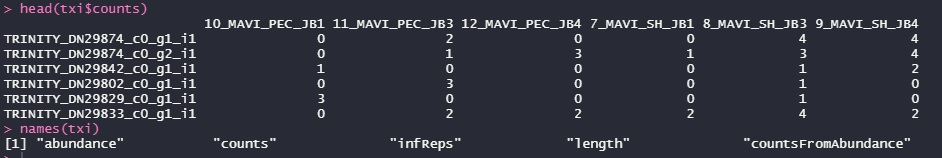

# Differential Expression Analysis using DESeq2

This tutorial was originally conceived by Chris Balakrishan and has been modified by Peri Bolton.

# Table of Contents

* differential expression of transcripts from Kallisto (#differential-expression-of-transcripts-from-kallisto)
	* tximport (#tximport)
	* DESeq2 (#deseq2)
* Gene-level differential expression (#gene-level-differential-expression)
	* Clustering and transformations (#clustering-and-transformations)


# Differential Expression of Transcripts from Kallisto

Yesterday you quantified transcripts from our experiment on different muscle types to our *de novo* assembly of *Manacus vitellinus*.
Today we are going to explore differential expression of these *transcripts* using ```DESeq2``` a standard method of evaluation differential expression.


## Move files to your desktop


Now, download ```~/<YOUR DIR>/MAVI_samples.txt``` from your directrory,  and the whole folder ```~/Bolton/kallisto_results/``` to your desktop. The latter folder is the results from the complete analysis.

To do this, open a new terminal window and navigate to to the folder you made for the tutorial.

Copy the file and folder across. The example below is for the folder. 


```bash
scp -r -P 1200 ngsclass@<IP.ADRESS>:~/Bolton/kallisto_results/ .
```


## Differential Expression

Open R Studio on your desktop, and load the following packages into your environment:

```r
BiocManager::install("DESeq2")
BiocManager::install("rhdf5")
BiocManager::install("tximport")

library(rhdf5)
library(tximport) 
library(DESeq2)
```

Then, make sure you're in your correct working directory. I made my tutorial folder on my desktop so it's stored here: 

```r
setwd("C:/Users/perif/Desktop/BioinformaticsWorkshop")
```

### Tximport

Read in the sample metadata, this is the one we made on the first day!
```r
samples <- read.table(file.path("MAVI_samples.txt"), header = TRUE, stringsAsFactors=FALSE)
samples<- samples[order(samples$sample),] ## make sure the sample names are in the order a computer would read them...
```


Now, let's make a named vector that contains the path to all the files we want to read in.

```r
files<- file.path("bioinformatics_data","kallisto_results", samples$sample, "abundance.h5")
names(files) <- samples$sample
```

Then we can use ```tximport``` to load in the data. 

```r
txi <- tximport(files, type = "kallisto", txOut = TRUE)
```

**Question 1:** What does the ```type=``` and ```txOut=``` arguments specify here?

Let's get a snapshot of our data

```r
names(txi)
head(txi$counts)
```
If you have something that looks like the picture below you are good to go.


**Question 2:** What do we need to use ```txtimport``` to get gene-level counts? Why might this be preferred? Look at the further reading from the lecture.

<br/>
<div align="right">
    <b><a href="#table-of-contents">^ back to TOC</a></b>
</div>
<br/>

### DESeq2

If ever you need help, DESeq has a great tutorial based [manual](http://bioconductor.org/packages/release/bioc/vignettes/DESeq2/inst/doc/DESeq2.html)

The sample metadata table needs to have row names that match the colum names for the ```txi``` object.

```r
rownames(samples)<- samples$sample
all.equal(rownames(samples), colnames(txi$counts)) #check that they're the same
```

If the last line returned ```TRUE``` you are good to go. 

```r
dds <- DESeqDataSetFromTximport(txi, samples, ~tissue)
dds<- DESeq(dds) #runs differential expression
```
Remember that DESeq runs each gene as a generalized linear model. So you can specify models in a similar way?

**Question 3:** Imagine there is another variable (e.g. Testosterone) that we want to understand the effect of on gene expression as well as tissue. How would you specify that model?

Ok, now we have to extract the differential expression results from the complicated ```DESeq2``` object called ```dds``` using the wrapper function ```results()```


```r
res <- results(dds, alpha=0.05)
res<- res[order(res$padj),] #orders results so the most significant are at the top.
res
```

**Question 4:** What does the ```alpha=``` argument specify? 

**Question 5:** Why do the results need a pvalue adjustmnet?

**Question 6:** What does the ```log2FoldChange``` column mean?

For a summary of the output we can use the ```summary()``` function on the results object.

```r
summary(res)
````

**Question 7:** How many transcripts are differentially expressed? 

Now, let's plot an MA plot. 

```r
plotMA(res)
```

**Question 8:** What do the dots represent? What are the blue ones? 

Now, let's export these data for later.

```r
write.csv(res, file="MAVI_results_DE_transcripts.csv", row.names=TRUE)
```

**For Discussion:** Why might there be issues inferring differential expression of transcripts using these methods? Why would `Sleuth` be more appropriate?

<br/>
<div align="right">
    <b><a href="#table-of-contents">^ back to TOC</a></b>
</div>
<br/>

# Gene-level differential expression

In the folder associated with this workshop, you should have a compiled set of STAR results ```bioinformatics_data/MAVI_STAR_results_compiled.csv```. These come from the full data, not the subset we have been using in the exercises. I generated these using the code in ```parsing_STAR_GeneCounts.R```

Now, in R studio, let's look at these data.

```r

samples <- read.table(file.path("MAVI_samples.txt"), header = TRUE, stringsAsFactors=TRUE)
data<- read.csv(file.path("bioinformatics_data","MAVI_STAR_results_compiled.csv"))
```

Let's look at the data

```r
head(data)
```

We have 1 row per gene, and 1 column per sample. If you need to calculate different normalisations of counts, such as Transcripts Per Million, you will need an estimate of gene length. 
We have a bunch of funny gene names at the top. Also R has introduced an X at the start because it doesn't like the column names starting with 7. We can delete these.

```r
colnames(data)<- gsub("^X","", colnames(data))
```

**Question 9:** Pick one of the LOC names from the first few rows of the data frame, and search in NCBI. Why do you think it has a name like this? What do the results on NCBI say about gene function?

Programs like [featureCounts](http://bioinf.wehi.edu.au/featureCounts/) and [HTseq-count](https://htseq.readthedocs.io/en/release_0.11.1/count.html) will extract the gene lengths from the genome annotation information when providing you with a file like this.
STAR's GeneCounts produces counts in the same way as default HTseq-count.


For an individual, let's look at the total counts
```r
sum(data$'7_MAVI_SH_JB1')
```

**Question 10:** STAR only counts the uniquely mapped reads that intersect with a gene "feature" in the annotation. Why is this number different from the total uniquely mapped reads we saw in the ```Log.final.out``` file?

Now, let's get the data ready for entry into ```DESeq2```. It likes to have the gene names as rows only. So we need to do that, and then remove the gene names column.

```r
rownames(data)<- data$gene_name
data$gene_name<- NULL

library(DEseq2)

dds<- DESeqDataSetFromMatrix(countData=data, colData=samples, design= ~ tissue)
dds<- DESeq(dds)
res<- results(dds, contrast=c("tissue","SH","PEC"), alpha=0.1)
res<- res[order(res$padj),]
res
summary(res)

```
**Question 11:** What does the ```contrast``` argument do? Consider how this might be used if you have >2 levels to your interest variable?

**Question 12:** How many significantly differentially expressed genes are there? What are the things that could contribute to it being different from the previous exercise?

**On your own** plot an MA plot showing the genes Log fold change against their mean count. Try a Volcano Plot too!

<br/>
<div align="right">
    <b><a href="#table-of-contents">^ back to TOC</a></b>
</div>
<br/>


## Clustering and transformations

In order to run in downstream functions such as PCA plots, heatmaps and analyses such as WGCNA we need to run a transformation on the data. These remove the dependance of the variance on the mean. 


```r
rld <- rlogTransformation(dds, blind=TRUE)
ntd <- normTransform(dds)
vsd<-  vst(dds)
notAllZero <- (rowSums(counts(dds))>0)
```
Now let's see what our transformations have done to the data


```r
BiocManager::install("vsn")
library(vsn)
meanSdPlot(assay(dds)[notAllZero,]) #untransformed data
meanSdPlot(assay(ntd)[notAllZero,])
meanSdPlot(assay(rld)[notAllZero,])
meanSdPlot(assay(vsd)[notAllZero,])
```

Note that variance stabilisation (vst) and rlog transformation are very similar. VST is faster with large datasets.

Now let's make a PCA plot.

```r
plotPCA(vsd, intgroup=c("tissue"))
```

For a more flexible and easier PCA plotting you can use an R package like [PCAtools](https://github.com/kevinblighe/PCAtools). 

Now let's plot the data as a heatmap. We can look at the overal difference in gene expression between samples.

```r
install.packages("pheatmap")
install.packages("RColorBrewer")

sampleDists <- dist(t(assay(vsd)))

sampleDistMatrix <- as.matrix(sampleDists)
rownames(sampleDistMatrix) <- paste(vsd$condition, vsd$type, sep="-")
colnames(sampleDistMatrix) <- NULL
library(RColorBrewer)
library(pheatmap)
colors <- colorRampPalette( rev(brewer.pal(9, "Blues")) )(255)
pheatmap(sampleDistMatrix,
         clustering_distance_rows=sampleDists,
         clustering_distance_cols=sampleDists,
         col=colors)
		 
```

**Question 14:** How might PCA plots and sample distance plots be used for quality control (e.g. outlier detection)? What can be said in this instance?


We can also plot these results according to the top most expressed genes.

```r
select <- order(rowMeans(counts(dds,normalized=TRUE)),
                decreasing=TRUE)[1:30]
df<- samples
rownames(df)<- df$sample
df$sample<- NULL
pheatmap(assay(vsd)[select,],cluster_rows=FALSE, show_rownames=TRUE,
         cluster_cols=FALSE,annotation_col=df)
```

```DESeq2``` also lets you plot the expression of a gene against the variables of interest. 


```r
acta1_exp<- plotCounts(dds, gene=row.names(res["ACTA1",]), intgroup=c("tissue"), returnData=TRUE)
library(ggplot2)
geneplot<- ggplot(acta1_exp, aes(x=tissue, y=count)) + geom_point(size=2) + labs(title=row.names(res["ACTA1",]), y="Normalised Counts") 
geneplot
```


** On your own: ** Now, plot the "top hit" (most significant gene) in our DE analysis. What is the name of this gene and what is its function?

Now, let's save your results
```r
write.csv(res, file="MAVI_results_DE_genes.csv", row.names=TRUE)
```

<br/>
<div align="right">
    <b><a href="#table-of-contents">^ back to TOC</a></b>
</div>
<br/>


# Assignment

Now apply your new skills to your assignment data.